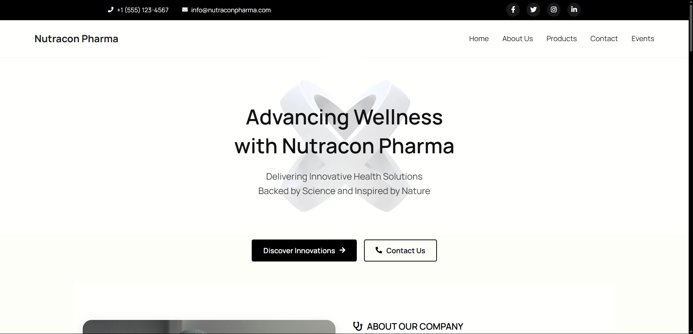
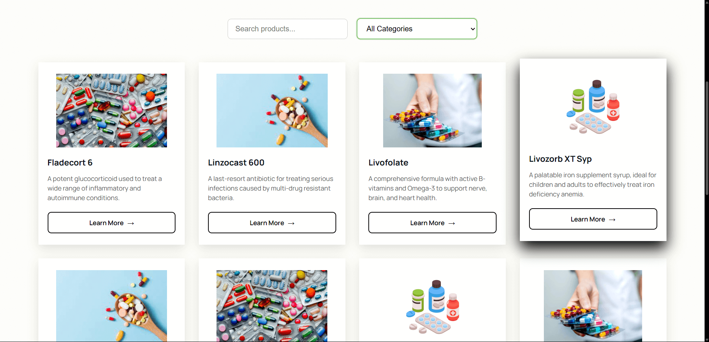

# 💊 Nutracon Pharma

Nutracon Pharma is a sleek and responsive website for a pharmaceutical brand. It displays medicines in a clean, user-friendly interface with dynamic search, category filters, and attractive product layouts. Built with a modern black-and-white gradient theme.

---

## 📸 Preview

<div align="center">
  
  <br><br>
  
  
</div>

---

## 🧪 Features

- 🩺 **Dynamic Product Cards**
- 🔍 **Live Search Functionality**
- 📂 **Category-based Filtering**
- 🎨 **Minimalistic Black & White UI with Hover Effects**
- 📱 **Fully Responsive Layout**

---

## 🛠️ Tech Stack

- HTML5  
- CSS3  
- JavaScript  (Vanilla)
- Font Awesome

---

## 🚀 Getting Started

1. **Clone the repository**
   ```bash
   git clone https://github.com/tabishfarhan7/Nutracon-Pharma.git


NUTRACON-PHARMA-
│
├── assets/ # Images, icons, and other static assets
│
├── css/ # Stylesheets
│ ├── style.css # Main stylesheet
│ ├── about.css # About page styles
│ ├── contact.css # Contact page styles
│ └── product.css # Product page styles
│
├── js/ # JavaScript files (scripts)
│
├── pages/ # Additional HTML pages
│
├── 1.html # Miscellaneous or test HTML file
├── index.html # Main landing/home page
└── README.md # Project documentation


🔮 Upcoming Additions
💳 Payment Gateway

📦 Backend Integration

✉️ Contact & Feedback Forms

👤 Author
MD Tabish Farhan
GitHub: @tabishfarhan7
LinkedIn: linkedin.com/in/md-tabish-farhan

📄 License
This project is licensed under the MIT License.